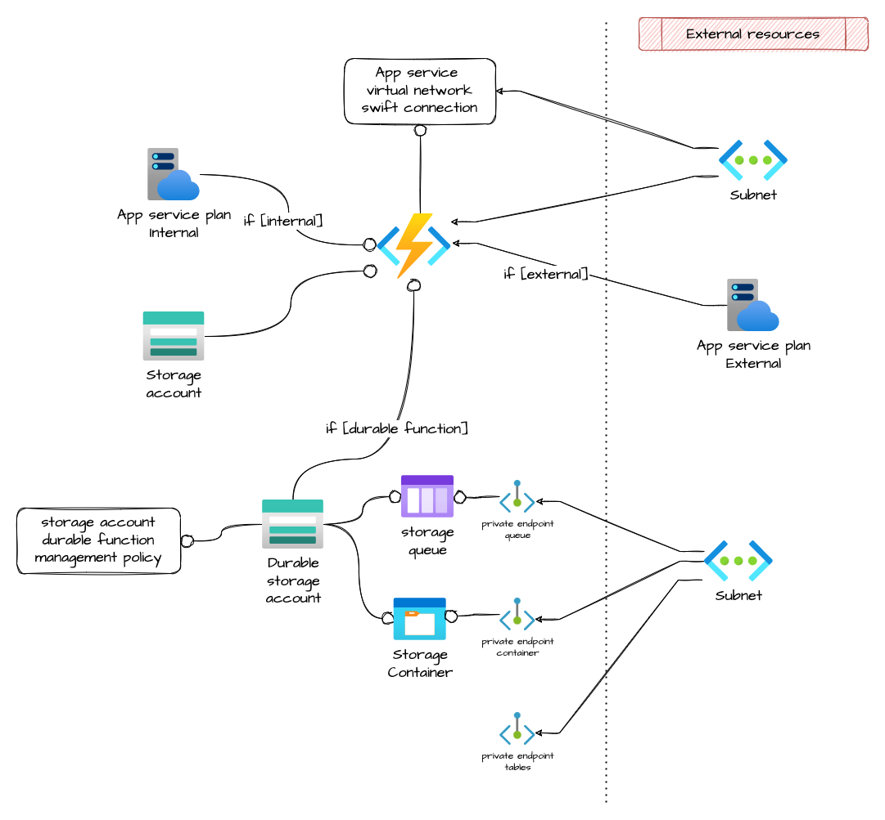

# Azure function app

Module that allows the creation of an Azure function app.
It creates a resource group named `test-fnapp<6 hexnumbers>-rg` and every resource into it is named `fnapp<6 hexnumbers>-*`

## Architecture



## How to use it
Use the example Terraform template, saved in `terraform-azurerm-v3/function_app/tests`, to test this module.

## How to migrate `from azurerm_function_app` to `azurerm_linux_function_app`
The following script will remove and import the deprecated resources as new ones.

```
#!/bin/bash

function removeAndImport() {
    ########################################
    # Remove and import a Terraform resource
    ########################################
    local old_resource_name="$1"
    # Square brackets are not processed normally by grep, otherwise
    esc_old_resource_name=$(echo "$old_resource_name" | sed 's/\[/\\[/g; s/\]/\\]/g')

    local new_resource_name="$2"

    if [ -z "$old_resource_name" ] || [ -z "$new_resource_name" ]; then
        echo "You need to define the resources to be removed and imported in order to proceed"
    exit 1
    fi
    if [ "$(terraform show | grep $esc_old_resource_name)" ]; then
        # Get the resource ID
        function_app_id=$(terraform show -json | jq --arg resource "$old_resource_name" '.values.root_module.child_modules[].resources[] | select(.address==$resource).values.id' | tr -d '"')
        echo "function_app_id: ${function_app_id}"
        # Import the resource
        terraform import $new_resource_name $function_app_id
        if [ $? -eq 0 ]; then
            echo "Successfully imported the resource with ID: $function_app_id"
            # Remove the resource from the state file
            terraform state rm "$old_resource_name"
            if [ $? -eq 0 ]; then
                echo "$old_resource_name removed"
            else
                echo "I can't remove the resource $old_resource_name from your Terraform state"
            fi
        else
            echo "I can't import the resource $new_resource_name"
        fi
    else
        echo "I can't find the resource $old_resource_name in your Terraform state"
    fi
}

# Check if the "Terraform" and "jq" commands are available
if ! which terraform &> /dev/null && which jq &> /dev/null; then
  echo "Please install terraform and jq before proceeding."
  exit 1
fi

removeAndImport "module.func_python.azurerm_function_app.this" "module.func_python.azurerm_linux_function_app.this"

removeAndImport "module.func_python.azurerm_app_service_plan.this[0]" "module.func_python.azurerm_service_plan.this[0]"
```

## Note about migrating from ```azurerm_function_app``` to ```azurerm_linux_function_app```

Since the resource `azurerm_function_app` has been deprecated in version 3.0 of the AzureRM provider, the newer `azurerm_linux_function_app` resource is used in this module, thus the following variables have been removed since they are not used anymore:
- os_type
- app_service_plan_info/sku_tier
- linux_fx_version

## How to configure the Linux framework

You need to specify **only** one variable of the following list:
- docker - (Optional) One or more docker blocks as defined below.
- dotnet_version - (Optional) The version of .NET to use. Possible values include 3.1, 6.0 and 7.0.
- use_dotnet_isolated_runtime - (Optional) Should the DotNet process use an isolated runtime. Defaults to false.
- java_version - (Optional) The Version of Java to use. Supported versions include 8, 11 & 17 (In-Preview).
- node_version - (Optional) The version of Node to run. Possible values include 12, 14, 16 and 18.
- python_version - (Optional) The version of Python to run. Possible values are 3.10, 3.9, 3.8 and 3.7.
- powershell_core_version - (Optional) The version of PowerShell Core to run. Possible values are 7, and 7.2.
- use_custom_runtime - (Optional) Should the Linux Function App use a custom runtime?

Of course, the values listed above may change in the future, so please check which ones are current.

## Migration from v2

Output for resource `azurerm_function_app_host_keys` changed

See [Generic resource migration](../.docs/MIGRATION_GUIDE_GENERIC_RESOURCES.md)

<!-- markdownlint-disable -->
<!-- BEGINNING OF PRE-COMMIT-TERRAFORM DOCS HOOK -->
## Requirements

| Name | Version |
|------|---------|
| <a name="requirement_terraform"></a> [terraform](#requirement\_terraform) | >= 1.3.0 |
| <a name="requirement_azurerm"></a> [azurerm](#requirement\_azurerm) | >= 3.30.0, <= 3.45.0 |

## Providers

| Name | Version |
|------|---------|
| <a name="provider_azurerm"></a> [azurerm](#provider\_azurerm) | >= 3.30.0, <= 3.45.0 |

## Modules

| Name | Source | Version |
|------|--------|---------|
| <a name="module_storage_account"></a> [storage\_account](#module\_storage\_account) | git::https://github.com/pagopa/terraform-azurerm-v3.git//storage_account | v5.1.0 |
| <a name="module_storage_account_durable_function"></a> [storage\_account\_durable\_function](#module\_storage\_account\_durable\_function) | git::https://github.com/pagopa/terraform-azurerm-v3.git//storage_account | v5.1.0 |

## Resources

| Name | Type |
|------|------|
| [azurerm_app_service_virtual_network_swift_connection.this](https://registry.terraform.io/providers/hashicorp/azurerm/latest/docs/resources/app_service_virtual_network_swift_connection) | resource |
| [azurerm_linux_function_app.this](https://registry.terraform.io/providers/hashicorp/azurerm/latest/docs/resources/linux_function_app) | resource |
| [azurerm_monitor_metric_alert.function_app_health_check](https://registry.terraform.io/providers/hashicorp/azurerm/latest/docs/resources/monitor_metric_alert) | resource |
| [azurerm_private_endpoint.blob](https://registry.terraform.io/providers/hashicorp/azurerm/latest/docs/resources/private_endpoint) | resource |
| [azurerm_private_endpoint.queue](https://registry.terraform.io/providers/hashicorp/azurerm/latest/docs/resources/private_endpoint) | resource |
| [azurerm_private_endpoint.table](https://registry.terraform.io/providers/hashicorp/azurerm/latest/docs/resources/private_endpoint) | resource |
| [azurerm_service_plan.this](https://registry.terraform.io/providers/hashicorp/azurerm/latest/docs/resources/service_plan) | resource |
| [azurerm_storage_container.internal_container](https://registry.terraform.io/providers/hashicorp/azurerm/latest/docs/resources/storage_container) | resource |
| [azurerm_storage_management_policy.internal_deleteafterdays](https://registry.terraform.io/providers/hashicorp/azurerm/latest/docs/resources/storage_management_policy) | resource |
| [azurerm_storage_queue.internal_queue](https://registry.terraform.io/providers/hashicorp/azurerm/latest/docs/resources/storage_queue) | resource |
| [azurerm_function_app_host_keys.this](https://registry.terraform.io/providers/hashicorp/azurerm/latest/docs/data-sources/function_app_host_keys) | data source |

## Inputs

| Name | Description | Type | Default | Required |
|------|-------------|------|---------|:--------:|
| <a name="input_action"></a> [action](#input\_action) | The ID of the Action Group and optional map of custom string properties to include with the post webhook operation. | <pre>set(object(<br>    {<br>      action_group_id    = string<br>      webhook_properties = map(string)<br>    }<br>  ))</pre> | `[]` | no |
| <a name="input_allowed_ips"></a> [allowed\_ips](#input\_allowed\_ips) | The IP Address used for this IP Restriction in CIDR notation | `list(string)` | `[]` | no |
| <a name="input_allowed_subnets"></a> [allowed\_subnets](#input\_allowed\_subnets) | List of subnet ids, The Virtual Network Subnet ID used for this IP Restriction. | `list(string)` | `[]` | no |
| <a name="input_always_on"></a> [always\_on](#input\_always\_on) | (Optional) Should the app be loaded at all times? Defaults to null. | `bool` | `null` | no |
| <a name="input_app_service_plan_id"></a> [app\_service\_plan\_id](#input\_app\_service\_plan\_id) | The external app service plan id to associate to the function. If null a new plan is created, use app\_service\_plan\_info to configure it. | `string` | `null` | no |
| <a name="input_app_service_plan_info"></a> [app\_service\_plan\_info](#input\_app\_service\_plan\_info) | Allows to configurate the internal service plan | <pre>object({<br>    kind                         = string # The kind of the App Service Plan to create. Possible values are Windows (also available as App), Linux, elastic (for Premium Consumption) and FunctionApp (for a Consumption Plan).<br>    sku_size                     = string # Specifies the plan's instance size.<br>    maximum_elastic_worker_count = number # The maximum number of total workers allowed for this ElasticScaleEnabled App Service Plan.<br>  })</pre> | <pre>{<br>  "kind": "Linux",<br>  "maximum_elastic_worker_count": 0,<br>  "sku_size": "P1v3"<br>}</pre> | no |
| <a name="input_app_service_plan_name"></a> [app\_service\_plan\_name](#input\_app\_service\_plan\_name) | Name of the app service plan. If null it will be 'computed' | `string` | `null` | no |
| <a name="input_app_settings"></a> [app\_settings](#input\_app\_settings) | n/a | `map(any)` | `{}` | no |
| <a name="input_application_insights_instrumentation_key"></a> [application\_insights\_instrumentation\_key](#input\_application\_insights\_instrumentation\_key) | Application insights instrumentation key | `string` | n/a | yes |
| <a name="input_client_certificate_enabled"></a> [client\_certificate\_enabled](#input\_client\_certificate\_enabled) | Should the function app use Client Certificates | `bool` | `false` | no |
| <a name="input_cors"></a> [cors](#input\_cors) | n/a | <pre>object({<br>    allowed_origins = list(string) # A list of origins which should be able to make cross-origin calls. * can be used to allow all calls.<br>  })</pre> | `null` | no |
| <a name="input_docker"></a> [docker](#input\_docker) | ##################### Framework choice ##################### | `any` | `{}` | no |
| <a name="input_domain"></a> [domain](#input\_domain) | Specifies the domain of the Function App. | `string` | `null` | no |
| <a name="input_dotnet_version"></a> [dotnet\_version](#input\_dotnet\_version) | n/a | `string` | `null` | no |
| <a name="input_enable_healthcheck"></a> [enable\_healthcheck](#input\_enable\_healthcheck) | Enable the healthcheck alert. Default is true | `bool` | `true` | no |
| <a name="input_export_keys"></a> [export\_keys](#input\_export\_keys) | n/a | `bool` | `false` | no |
| <a name="input_health_check_maxpingfailures"></a> [health\_check\_maxpingfailures](#input\_health\_check\_maxpingfailures) | Max ping failures allowed | `number` | `10` | no |
| <a name="input_health_check_path"></a> [health\_check\_path](#input\_health\_check\_path) | Path which will be checked for this function app health. | `string` | `null` | no |
| <a name="input_healthcheck_threshold"></a> [healthcheck\_threshold](#input\_healthcheck\_threshold) | The healthcheck threshold. If metric average is under this value, the alert will be triggered. Default is 50 | `number` | `50` | no |
| <a name="input_https_only"></a> [https\_only](#input\_https\_only) | (Required) Can the Function App only be accessed via HTTPS?. Defaults true | `bool` | `true` | no |
| <a name="input_internal_storage"></a> [internal\_storage](#input\_internal\_storage) | n/a | <pre>object({<br>    enable                     = bool<br>    private_endpoint_subnet_id = string<br>    private_dns_zone_blob_ids  = list(string)<br>    private_dns_zone_queue_ids = list(string)<br>    private_dns_zone_table_ids = list(string)<br>    queues                     = list(string) # Queues names<br>    containers                 = list(string) # Containers names<br>    blobs_retention_days       = number<br>  })</pre> | <pre>{<br>  "blobs_retention_days": 1,<br>  "containers": [],<br>  "enable": false,<br>  "private_dns_zone_blob_ids": [],<br>  "private_dns_zone_queue_ids": [],<br>  "private_dns_zone_table_ids": [],<br>  "private_endpoint_subnet_id": "dummy",<br>  "queues": []<br>}</pre> | no |
| <a name="input_java_version"></a> [java\_version](#input\_java\_version) | n/a | `string` | `null` | no |
| <a name="input_location"></a> [location](#input\_location) | n/a | `string` | n/a | yes |
| <a name="input_name"></a> [name](#input\_name) | (Required) Specifies the name of the Function App. Changing this forces a new resource to be created. | `string` | n/a | yes |
| <a name="input_node_version"></a> [node\_version](#input\_node\_version) | n/a | `string` | `null` | no |
| <a name="input_powershell_core_version"></a> [powershell\_core\_version](#input\_powershell\_core\_version) | n/a | `string` | `null` | no |
| <a name="input_pre_warmed_instance_count"></a> [pre\_warmed\_instance\_count](#input\_pre\_warmed\_instance\_count) | The number of pre-warmed instances for this function app. Only affects apps on the Premium plan. | `number` | `1` | no |
| <a name="input_python_version"></a> [python\_version](#input\_python\_version) | n/a | `string` | `null` | no |
| <a name="input_resource_group_name"></a> [resource\_group\_name](#input\_resource\_group\_name) | n/a | `string` | n/a | yes |
| <a name="input_runtime_version"></a> [runtime\_version](#input\_runtime\_version) | The runtime version associated with the Function App. Version ~3 is required for Linux Function Apps. | `string` | `"~3"` | no |
| <a name="input_sticky_settings"></a> [sticky\_settings](#input\_sticky\_settings) | (Optional) A list of app\_setting names that the Linux Function App will not swap between Slots when a swap operation is triggered | `list(string)` | `[]` | no |
| <a name="input_storage_account_durable_name"></a> [storage\_account\_durable\_name](#input\_storage\_account\_durable\_name) | Storage account name only used by the durable function. If null it will be 'computed' | `string` | `null` | no |
| <a name="input_storage_account_info"></a> [storage\_account\_info](#input\_storage\_account\_info) | n/a | <pre>object({<br>    account_kind                      = string # Defines the Kind of account. Valid options are BlobStorage, BlockBlobStorage, FileStorage, Storage and StorageV2. Changing this forces a new resource to be created. Defaults to Storage.<br>    account_tier                      = string # Defines the Tier to use for this storage account. Valid options are Standard and Premium. For BlockBlobStorage and FileStorage accounts only Premium is valid.<br>    account_replication_type          = string # Defines the type of replication to use for this storage account. Valid options are LRS, GRS, RAGRS, ZRS, GZRS and RAGZRS.<br>    access_tier                       = string # Defines the access tier for BlobStorage, FileStorage and StorageV2 accounts. Valid options are Hot and Cool, defaults to Hot.<br>    advanced_threat_protection_enable = bool<br>  })</pre> | <pre>{<br>  "access_tier": "Hot",<br>  "account_kind": "StorageV2",<br>  "account_replication_type": "ZRS",<br>  "account_tier": "Standard",<br>  "advanced_threat_protection_enable": true<br>}</pre> | no |
| <a name="input_storage_account_name"></a> [storage\_account\_name](#input\_storage\_account\_name) | Storage account name. If null it will be 'computed' | `string` | `null` | no |
| <a name="input_subnet_id"></a> [subnet\_id](#input\_subnet\_id) | The ID of the subnet the app service will be associated to (the subnet must have a service\_delegation configured for Microsoft.Web/serverFarms) | `string` | n/a | yes |
| <a name="input_system_identity_enabled"></a> [system\_identity\_enabled](#input\_system\_identity\_enabled) | Enable the System Identity and create relative Service Principal. | `bool` | `false` | no |
| <a name="input_tags"></a> [tags](#input\_tags) | n/a | `map(any)` | n/a | yes |
| <a name="input_use_32_bit_worker_process"></a> [use\_32\_bit\_worker\_process](#input\_use\_32\_bit\_worker\_process) | (Optional) Should the Function App run in 32 bit mode, rather than 64 bit mode? Defaults to false. | `bool` | `false` | no |
| <a name="input_use_custom_runtime"></a> [use\_custom\_runtime](#input\_use\_custom\_runtime) | n/a | `string` | `null` | no |
| <a name="input_use_dotnet_isolated_runtime"></a> [use\_dotnet\_isolated\_runtime](#input\_use\_dotnet\_isolated\_runtime) | n/a | `string` | `null` | no |
| <a name="input_vnet_integration"></a> [vnet\_integration](#input\_vnet\_integration) | (optional) Enable vnet integration. Wheter it's true the subnet\_id should not be null. | `bool` | `true` | no |

## Outputs

| Name | Description |
|------|-------------|
| <a name="output_app_service_plan_id"></a> [app\_service\_plan\_id](#output\_app\_service\_plan\_id) | n/a |
| <a name="output_app_service_plan_name"></a> [app\_service\_plan\_name](#output\_app\_service\_plan\_name) | n/a |
| <a name="output_default_hostname"></a> [default\_hostname](#output\_default\_hostname) | n/a |
| <a name="output_default_key"></a> [default\_key](#output\_default\_key) | n/a |
| <a name="output_id"></a> [id](#output\_id) | n/a |
| <a name="output_master_key"></a> [master\_key](#output\_master\_key) | n/a |
| <a name="output_name"></a> [name](#output\_name) | n/a |
| <a name="output_possible_outbound_ip_addresses"></a> [possible\_outbound\_ip\_addresses](#output\_possible\_outbound\_ip\_addresses) | n/a |
| <a name="output_primary_key"></a> [primary\_key](#output\_primary\_key) | n/a |
| <a name="output_storage_account"></a> [storage\_account](#output\_storage\_account) | n/a |
| <a name="output_storage_account_internal_function"></a> [storage\_account\_internal\_function](#output\_storage\_account\_internal\_function) | Storage account used by the function for internal operations. |
| <a name="output_storage_account_internal_function_name"></a> [storage\_account\_internal\_function\_name](#output\_storage\_account\_internal\_function\_name) | Storage account used by the function for internal operations. |
| <a name="output_storage_account_name"></a> [storage\_account\_name](#output\_storage\_account\_name) | n/a |
| <a name="output_system_identity_principal"></a> [system\_identity\_principal](#output\_system\_identity\_principal) | Service Principal of the System Identity generated by Azure. |
<!-- END OF PRE-COMMIT-TERRAFORM DOCS HOOK -->