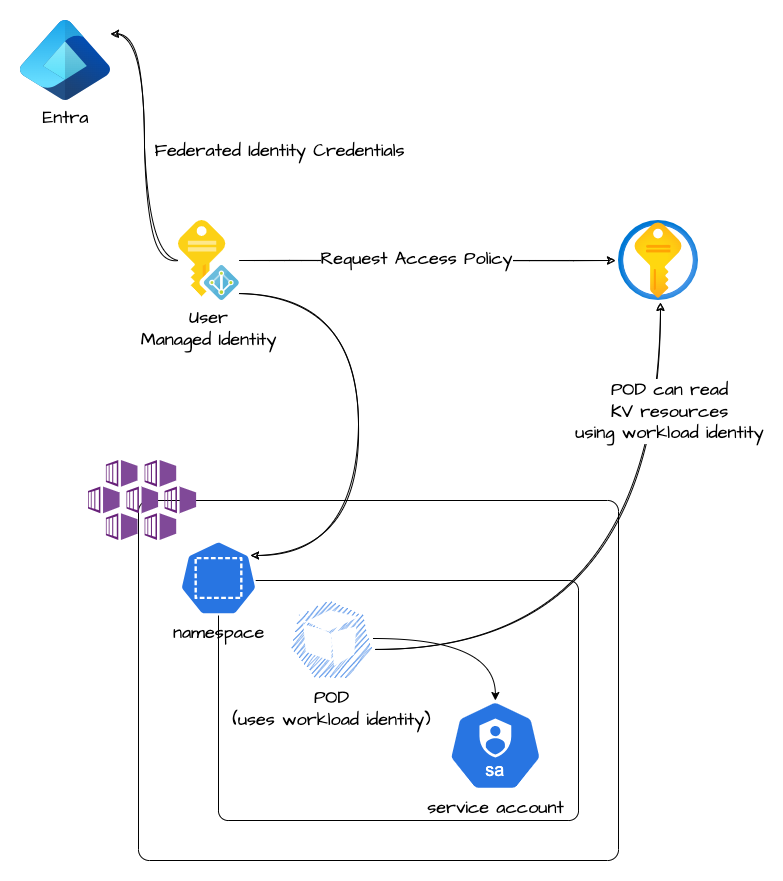

# kubernetes workload identity configuration

Module that allows the configuration of a workload identity.

To enable workload identity this others resources are created/configured:

* user managed identity (already present into the system)
* federated identity
* key vault policy
* service account with user managed client id

## Architecture



## How to use it

```hcl
module "workload_identity" {
  source = "git::https://github.com/pagopa/terraform-azurerm-v3.git//kubernetes_workload_identity?ref=workload-identity-setup"

  workload_name_prefix                  = var.domain
  workload_identity_resource_group_name = data.azurerm_kubernetes_cluster.aks.resource_group_name
  aks_name                              = data.azurerm_kubernetes_cluster.aks.name
  aks_resource_group_name               = data.azurerm_kubernetes_cluster.aks.resource_group_name
  namespace                             = var.domain

  key_vault_id                      = data.azurerm_key_vault.kv_domain.id
  key_vault_certificate_permissions = ["Get"]
  key_vault_key_permissions         = ["Get"]
  key_vault_secret_permissions      = ["Get"]
}
```

<!-- markdownlint-disable -->
<!-- BEGINNING OF PRE-COMMIT-TERRAFORM DOCS HOOK -->
## Requirements

| Name | Version |
|------|---------|
| <a name="requirement_terraform"></a> [terraform](#requirement\_terraform) | >= 1.5.0 |
| <a name="requirement_azurerm"></a> [azurerm](#requirement\_azurerm) | ~>3.110 |
| <a name="requirement_kubernetes"></a> [kubernetes](#requirement\_kubernetes) | ~> 2.30.0 |
| <a name="requirement_null"></a> [null](#requirement\_null) | ~> 3.2 |

## Modules

No modules.

## Resources

| Name | Type |
|------|------|
| [azurerm_federated_identity_credential.workload_identity_federation](https://registry.terraform.io/providers/hashicorp/azurerm/latest/docs/resources/federated_identity_credential) | resource |
| [azurerm_key_vault_access_policy.this](https://registry.terraform.io/providers/hashicorp/azurerm/latest/docs/resources/key_vault_access_policy) | resource |
| [azurerm_key_vault_secret.workload_identity_client_id](https://registry.terraform.io/providers/hashicorp/azurerm/latest/docs/resources/key_vault_secret) | resource |
| [kubernetes_service_account_v1.workload_identity_sa](https://registry.terraform.io/providers/hashicorp/kubernetes/latest/docs/resources/service_account_v1) | resource |
| [azurerm_kubernetes_cluster.aks](https://registry.terraform.io/providers/hashicorp/azurerm/latest/docs/data-sources/kubernetes_cluster) | data source |
| [azurerm_user_assigned_identity.this](https://registry.terraform.io/providers/hashicorp/azurerm/latest/docs/data-sources/user_assigned_identity) | data source |

## Inputs

| Name | Description | Type | Default | Required |
|------|-------------|------|---------|:--------:|
| <a name="input_aks_name"></a> [aks\_name](#input\_aks\_name) | (Required) Name of the Kubernetes cluster. | `string` | n/a | yes |
| <a name="input_aks_resource_group_name"></a> [aks\_resource\_group\_name](#input\_aks\_resource\_group\_name) | (Required) Resource group of the Kubernetes cluster. | `string` | n/a | yes |
| <a name="input_key_vault_certificate_permissions"></a> [key\_vault\_certificate\_permissions](#input\_key\_vault\_certificate\_permissions) | (Required) API permissions of the identity to access certificates, must be one or more from the following: Backup, Create, Delete, DeleteIssuers, Get, GetIssuers, Import, List, ListIssuers, ManageContacts, ManageIssuers, Purge, Recover, Restore, SetIssuers and Update. | `list(string)` | <pre>[<br>  ""<br>]</pre> | no |
| <a name="input_key_vault_configuration_enabled"></a> [key\_vault\_configuration\_enabled](#input\_key\_vault\_configuration\_enabled) | (Optional) Enabled the configuration for key vault operations | `bool` | `true` | no |
| <a name="input_key_vault_id"></a> [key\_vault\_id](#input\_key\_vault\_id) | (Required) Specifies the id of the Key Vault resource. Changing this forces a new resource to be created. | `any` | `null` | no |
| <a name="input_key_vault_key_permissions"></a> [key\_vault\_key\_permissions](#input\_key\_vault\_key\_permissions) | (Required) API permissions of the identity to access keys, must be one or more from the following: Backup, Create, Decrypt, Delete, Encrypt, Get, Import, List, Purge, Recover, Restore, Sign, UnwrapKey, Update, Verify and WrapKey. | `list(string)` | <pre>[<br>  ""<br>]</pre> | no |
| <a name="input_key_vault_secret_permissions"></a> [key\_vault\_secret\_permissions](#input\_key\_vault\_secret\_permissions) | (Required) API permissions of the identity to access secrets, must be one or more from the following: Backup, Delete, Get, List, Purge, Recover, Restore and Set. | `list(string)` | <pre>[<br>  ""<br>]</pre> | no |
| <a name="input_namespace"></a> [namespace](#input\_namespace) | (Required) Kubernetes namespace where the pod identity will be create. | `string` | n/a | yes |
| <a name="input_service_account_annotations"></a> [service\_account\_annotations](#input\_service\_account\_annotations) | (Optional) More annotations for service account | `map(string)` | `{}` | no |
| <a name="input_service_account_configuration_enabled"></a> [service\_account\_configuration\_enabled](#input\_service\_account\_configuration\_enabled) | (Optional) Enabled the service account configuration | `string` | `true` | no |
| <a name="input_service_account_image_pull_secret_names"></a> [service\_account\_image\_pull\_secret\_names](#input\_service\_account\_image\_pull\_secret\_names) | (Optional) Sets of image pull secert names | `set(string)` | `[]` | no |
| <a name="input_service_account_labels"></a> [service\_account\_labels](#input\_service\_account\_labels) | (Optional) More Labels for service account | `map(string)` | `{}` | no |
| <a name="input_workload_identity_name"></a> [workload\_identity\_name](#input\_workload\_identity\_name) | (Required) The full name for the user assigned identity and Workload identity. Changing this forces a new configuration to be created. | `string` | `null` | no |
| <a name="input_workload_identity_name_prefix"></a> [workload\_identity\_name\_prefix](#input\_workload\_identity\_name\_prefix) | (Required) The prefix name for the user assigned identity and Workload identity. Changing this forces a new configuration to be created. | `string` | n/a | yes |
| <a name="input_workload_identity_resource_group_name"></a> [workload\_identity\_resource\_group\_name](#input\_workload\_identity\_resource\_group\_name) | (Required) Resource group for the workload identity. Changing this forces a new configuration to be created. | `string` | n/a | yes |

## Outputs

| Name | Description |
|------|-------------|
| <a name="output_user_assigned_identity_client_id"></a> [user\_assigned\_identity\_client\_id](#output\_user\_assigned\_identity\_client\_id) | n/a |
| <a name="output_user_assigned_identity_id"></a> [user\_assigned\_identity\_id](#output\_user\_assigned\_identity\_id) | n/a |
| <a name="output_user_assigned_identity_name"></a> [user\_assigned\_identity\_name](#output\_user\_assigned\_identity\_name) | n/a |
| <a name="output_user_assigned_identity_principal_id"></a> [user\_assigned\_identity\_principal\_id](#output\_user\_assigned\_identity\_principal\_id) | n/a |
| <a name="output_user_assigned_identity_resource_group_name"></a> [user\_assigned\_identity\_resource\_group\_name](#output\_user\_assigned\_identity\_resource\_group\_name) | n/a |
| <a name="output_workload_identity_client_id"></a> [workload\_identity\_client\_id](#output\_workload\_identity\_client\_id) | n/a |
| <a name="output_workload_identity_client_id_secret_name"></a> [workload\_identity\_client\_id\_secret\_name](#output\_workload\_identity\_client\_id\_secret\_name) | n/a |
| <a name="output_workload_identity_principal_id"></a> [workload\_identity\_principal\_id](#output\_workload\_identity\_principal\_id) | n/a |
| <a name="output_workload_identity_service_account_name"></a> [workload\_identity\_service\_account\_name](#output\_workload\_identity\_service\_account\_name) | n/a |
| <a name="output_workload_identity_service_account_namespace"></a> [workload\_identity\_service\_account\_namespace](#output\_workload\_identity\_service\_account\_namespace) | n/a |
<!-- END OF PRE-COMMIT-TERRAFORM DOCS HOOK -->
