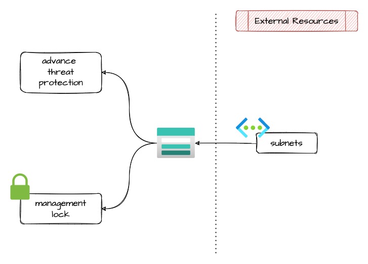

# storage account

Module that allows the creation of an Storage account.
It creates a resource group named `azrmtest<6 hexnumbers>-rg` and every resource into it is named `azrmtest<6 hexnumbers>-*`.
In terraform output you can get the resource group name.

## Architecture



## Logic breaking changes

* `enable_resource_advanced_threat_protection` was removed -> now use only `advanced_threat_protection`

## How to use it

### simple example

Use the example Terraform template, saved in `tests`, to test this module.

## Known Issues

* Applying the immutability policy on an existing storage account fails due to a 404 NotFound error on the threat protection creation for the new storage. Solution, delete the resource and create the new one with the immutability policy.
* Changing the `period_since_creation_in_days` will be updated in terraform state but not in the cloud provider resource. Solution, change the value using the Azure portal.

## Migration from v2

🆕 To use this module you need to use change this variables/arguments:

* `blob_properties_delete_retention_policy_days` -> `blob_delete_retention_days`
* `allow_blob_public_access` -> `allow_nested_items_to_be_public`
* `enable_versioning` -> `blob_versioning_enabled`

❌ Don't use this variables:

* `enable_https_traffic_only` -> don't use any more, now default is true and mandatory
* `versioning_name`

❌ Don't use locks because are managed outside of the module:

* `lock_enabled`
* `lock_name`
* `lock_level`  
* `lock_notes`

🔥 destroied resources

* `module.<name>.azurerm_template_deployment.versioning[0]` is destroied becuase we use an internal variable and not more an arm.

### Migration results

During the apply there will be this result:

* 1 changed (related to storage, that need to update one property `cross_tenant_replication_enabled`)

* 2 destroy (related to storage, that need to destroy the old arm command for versioning `azurerm_template_deployment.versioning`)

like this:

```ts
  # module.devopslab_cdn.module.cdn_storage_account.azurerm_storage_account.this will be updated in-place
  ~ resource "azurerm_storage_account" "this" {
      + cross_tenant_replication_enabled  = true
        id                                = "/subscriptions/ac17914c-79bf-48fa-831e-1359ef74c1d5/resourceGroups/dvopla-d-neu-diego-cdn-rg/providers/Microsoft.Storage/storageAccounts/dvopladdiegosa"
        name                              = "dvopladdiegosa"
        tags                              = {
            "Application" = "diego.common"
            "CostCenter"  = "TS310 - PAGAMENTI & SERVIZI"
            "CreatedBy"   = "Terraform"
            "Environment" = "Dev"
            "Owner"       = "devops"
            "Source"      = "https://github.com/pagopa/dvopla-infrastructure"
        }
        # (37 unchanged attributes hidden)

        # (5 unchanged blocks hidden)
    }

  # module.devopslab_cdn.module.cdn_storage_account.azurerm_template_deployment.versioning[0] will be destroyed
  # (because azurerm_template_deployment.versioning is not in configuration)
  - resource "azurerm_template_deployment" "versioning" {
      - deployment_mode     = "Incremental" -> null
      - id                  = "/subscriptions/ac17914c-79bf-48fa-831e-1359ef74c1d5/resourceGroups/dvopla-d-neu-diego-cdn-rg/providers/Microsoft.Resources/deployments/dvopla-d-diego-sa-versioning" -> null
      - name                = "dvopla-d-diego-sa-versioning" -> null
      - outputs             = {} -> null
      - parameters          = {
          - "storageAccount" = "dvopladdiegosa"
        } -> null
      - resource_group_name = "dvopla-d-neu-diego-cdn-rg" -> null
      - template_body       = jsonencode(
            {
              - "$schema"      = "https://schema.management.azure.com/schemas/2015-01-01/deploymentTemplate.json#"
              - contentVersion = "1.0.0.0"
              - parameters     = {
                  - storageAccount = {
                      - metadata = {
                          - description = "Storage Account Name"
                        }
                      - type     = "string"
                    }
                }
              - resources      = [
                  - {
                      - apiVersion = "2019-06-01"
                      - name       = "[concat(parameters('storageAccount'), '/default')]"
                      - properties = {
                          - IsVersioningEnabled = true
                        }
                      - type       = "Microsoft.Storage/storageAccounts/blobServices"
                    },
                ]
              - variables      = {}
            }
        ) -> null
    }
```

<!-- markdownlint-disable -->
<!-- BEGINNING OF PRE-COMMIT-TERRAFORM DOCS HOOK -->
## Requirements

| Name | Version |
|------|---------|
| <a name="requirement_terraform"></a> [terraform](#requirement\_terraform) | >= 1.3.0 |
| <a name="requirement_azurerm"></a> [azurerm](#requirement\_azurerm) | >= 3.76.0, <= 3.102.0 |

## Modules

No modules.

## Resources

| Name | Type |
|------|------|
| [azurerm_advanced_threat_protection.this](https://registry.terraform.io/providers/hashicorp/azurerm/latest/docs/resources/advanced_threat_protection) | resource |
| [azurerm_monitor_metric_alert.storage_account_low_availability](https://registry.terraform.io/providers/hashicorp/azurerm/latest/docs/resources/monitor_metric_alert) | resource |
| [azurerm_security_center_storage_defender.this](https://registry.terraform.io/providers/hashicorp/azurerm/latest/docs/resources/security_center_storage_defender) | resource |
| [azurerm_storage_account.this](https://registry.terraform.io/providers/hashicorp/azurerm/latest/docs/resources/storage_account) | resource |
| [null_resource.immutability](https://registry.terraform.io/providers/hashicorp/null/latest/docs/resources/resource) | resource |

## Inputs

| Name | Description | Type | Default | Required |
|------|-------------|------|---------|:--------:|
| <a name="input_access_tier"></a> [access\_tier](#input\_access\_tier) | (Optional) Defines the access tier for BlobStorage, FileStorage and StorageV2 accounts. Valid options are Hot and Cool, defaults to Hot | `string` | `null` | no |
| <a name="input_account_kind"></a> [account\_kind](#input\_account\_kind) | (Optional) Defines the Kind of account. Valid options are BlobStorage, BlockBlobStorage, FileStorage, Storage and StorageV2. Changing this forces a new resource to be created. | `string` | `"StorageV2"` | no |
| <a name="input_account_replication_type"></a> [account\_replication\_type](#input\_account\_replication\_type) | Defines the type of replication to use for this storage account. Valid options are LRS, GRS, RAGRS, ZRS, GZRS and RAGZRS. Changing this forces a new resource to be created when types LRS, GRS and RAGRS are changed to ZRS, GZRS or RAGZRS and vice versa | `string` | n/a | yes |
| <a name="input_account_tier"></a> [account\_tier](#input\_account\_tier) | Defines the Tier to use for this storage account. Valid options are Standard and Premium. For BlockBlobStorage and FileStorage accounts only Premium is valid. Changing this forces a new resource to be created. | `string` | n/a | yes |
| <a name="input_action"></a> [action](#input\_action) | The ID of the Action Group and optional map of custom string properties to include with the post webhook operation. | <pre>set(object(<br>    {<br>      action_group_id    = string<br>      webhook_properties = map(string)<br>    }<br>  ))</pre> | `[]` | no |
| <a name="input_advanced_threat_protection"></a> [advanced\_threat\_protection](#input\_advanced\_threat\_protection) | Should Advanced Threat Protection be enabled on this resource? | `bool` | `false` | no |
| <a name="input_allow_nested_items_to_be_public"></a> [allow\_nested\_items\_to\_be\_public](#input\_allow\_nested\_items\_to\_be\_public) | Allow or disallow public access to all blobs or containers in the storage account. | `bool` | `false` | no |
| <a name="input_blob_change_feed_enabled"></a> [blob\_change\_feed\_enabled](#input\_blob\_change\_feed\_enabled) | (Optional) Is the blob service properties for change feed events enabled? Default to false. | `bool` | `false` | no |
| <a name="input_blob_change_feed_retention_in_days"></a> [blob\_change\_feed\_retention\_in\_days](#input\_blob\_change\_feed\_retention\_in\_days) | (Optional) The duration of change feed events retention in days. The possible values are between 1 and 146000 days (400 years). Setting this to null (or omit this in the configuration file) indicates an infinite retention of the change feed. | `number` | `null` | no |
| <a name="input_blob_container_delete_retention_days"></a> [blob\_container\_delete\_retention\_days](#input\_blob\_container\_delete\_retention\_days) | Retention days for deleted container. Valid value is between 1 and 365 (set to 0 to disable). | `number` | `0` | no |
| <a name="input_blob_delete_retention_days"></a> [blob\_delete\_retention\_days](#input\_blob\_delete\_retention\_days) | Retention days for deleted blob. Valid value is between 1 and 365 (set to 0 to disable). | `number` | `0` | no |
| <a name="input_blob_last_access_time_enabled"></a> [blob\_last\_access\_time\_enabled](#input\_blob\_last\_access\_time\_enabled) | (Optional) Is the blob service properties for trace last access time. Default to false. | `bool` | `false` | no |
| <a name="input_blob_storage_policy"></a> [blob\_storage\_policy](#input\_blob\_storage\_policy) | Handle immutability policy for stored elements | <pre>object({<br>    enable_immutability_policy = bool<br>    blob_restore_policy_days   = number<br>  })</pre> | <pre>{<br>  "blob_restore_policy_days": 0,<br>  "enable_immutability_policy": false<br>}</pre> | no |
| <a name="input_blob_versioning_enabled"></a> [blob\_versioning\_enabled](#input\_blob\_versioning\_enabled) | Controls whether blob object versioning is enabled. | `bool` | `false` | no |
| <a name="input_cross_tenant_replication_enabled"></a> [cross\_tenant\_replication\_enabled](#input\_cross\_tenant\_replication\_enabled) | (Optional) Should cross Tenant replication be enabled? Defaults to false. | `bool` | `false` | no |
| <a name="input_custom_domain"></a> [custom\_domain](#input\_custom\_domain) | Custom domain for accessing blob data | <pre>object({<br>    name          = string<br>    use_subdomain = bool<br>  })</pre> | <pre>{<br>  "name": null,<br>  "use_subdomain": false<br>}</pre> | no |
| <a name="input_domain"></a> [domain](#input\_domain) | (Optional) Specifies the domain of the Storage Account. | `string` | `null` | no |
| <a name="input_enable_identity"></a> [enable\_identity](#input\_enable\_identity) | (Optional) If true, set the identity as SystemAssigned | `bool` | `false` | no |
| <a name="input_enable_low_availability_alert"></a> [enable\_low\_availability\_alert](#input\_enable\_low\_availability\_alert) | Enable the Low Availability alert. Default is true | `bool` | `true` | no |
| <a name="input_error_404_document"></a> [error\_404\_document](#input\_error\_404\_document) | The absolute path to a custom webpage that should be used when a request is made which does not correspond to an existing file. | `string` | `null` | no |
| <a name="input_immutability_policy_props"></a> [immutability\_policy\_props](#input\_immutability\_policy\_props) | Properties to setup the immutability policy. The resource can be created only with "Disabled" and "Unlocked" state. Change to "Locked" state doens't update the resource for a bug of the current module. | <pre>object({<br>    allow_protected_append_writes = bool<br>    period_since_creation_in_days = number<br>  })</pre> | <pre>{<br>  "allow_protected_append_writes": false,<br>  "period_since_creation_in_days": 730<br>}</pre> | no |
| <a name="input_index_document"></a> [index\_document](#input\_index\_document) | The webpage that Azure Storage serves for requests to the root of a website or any subfolder. For example, index.html. The value is case-sensitive. | `string` | `null` | no |
| <a name="input_is_hns_enabled"></a> [is\_hns\_enabled](#input\_is\_hns\_enabled) | Enable Hierarchical Namespace enabled (Azure Data Lake Storage Gen 2). Changing this forces a new resource to be created. | `bool` | `false` | no |
| <a name="input_is_sftp_enabled"></a> [is\_sftp\_enabled](#input\_is\_sftp\_enabled) | Enable SFTP | `bool` | `false` | no |
| <a name="input_location"></a> [location](#input\_location) | n/a | `string` | n/a | yes |
| <a name="input_low_availability_threshold"></a> [low\_availability\_threshold](#input\_low\_availability\_threshold) | The Low Availability threshold. If metric average is under this value, the alert will be triggered. Default is 99.8 | `number` | `99.8` | no |
| <a name="input_min_tls_version"></a> [min\_tls\_version](#input\_min\_tls\_version) | The minimum supported TLS version for the storage account. Possible values are TLS1\_0, TLS1\_1, and TLS1\_2 | `string` | `"TLS1_2"` | no |
| <a name="input_name"></a> [name](#input\_name) | n/a | `string` | n/a | yes |
| <a name="input_network_rules"></a> [network\_rules](#input\_network\_rules) | n/a | <pre>object({<br>    default_action             = string       # Specifies the default action of allow or deny when no other rules match. Valid options are Deny or Allow<br>    bypass                     = set(string)  # Specifies whether traffic is bypassed for Logging/Metrics/AzureServices. Valid options are any combination of Logging, Metrics, AzureServices, or None<br>    ip_rules                   = list(string) # List of public IP or IP ranges in CIDR Format. Only IPV4 addresses are allowed<br>    virtual_network_subnet_ids = list(string) # A list of resource ids for subnets.<br>  })</pre> | `null` | no |
| <a name="input_public_network_access_enabled"></a> [public\_network\_access\_enabled](#input\_public\_network\_access\_enabled) | Enable or Disable public access. It should always set to false unless there are special needs | `bool` | n/a | yes |
| <a name="input_resource_group_name"></a> [resource\_group\_name](#input\_resource\_group\_name) | n/a | `string` | n/a | yes |
| <a name="input_tags"></a> [tags](#input\_tags) | n/a | `map(any)` | n/a | yes |
| <a name="input_use_legacy_defender_version"></a> [use\_legacy\_defender\_version](#input\_use\_legacy\_defender\_version) | (Optional) If true, applies the old pricing model. Very important - check the pricing model that is more convenient for your kind of usage | `bool` | `true` | no |

## Outputs

| Name | Description |
|------|-------------|
| <a name="output_id"></a> [id](#output\_id) | n/a |
| <a name="output_identity"></a> [identity](#output\_identity) | n/a |
| <a name="output_name"></a> [name](#output\_name) | n/a |
| <a name="output_primary_access_key"></a> [primary\_access\_key](#output\_primary\_access\_key) | n/a |
| <a name="output_primary_blob_connection_string"></a> [primary\_blob\_connection\_string](#output\_primary\_blob\_connection\_string) | n/a |
| <a name="output_primary_blob_host"></a> [primary\_blob\_host](#output\_primary\_blob\_host) | n/a |
| <a name="output_primary_connection_string"></a> [primary\_connection\_string](#output\_primary\_connection\_string) | n/a |
| <a name="output_primary_web_host"></a> [primary\_web\_host](#output\_primary\_web\_host) | n/a |
| <a name="output_resource_group_name"></a> [resource\_group\_name](#output\_resource\_group\_name) | n/a |
<!-- END OF PRE-COMMIT-TERRAFORM DOCS HOOK -->
